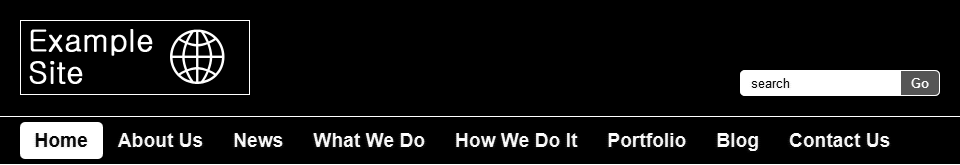
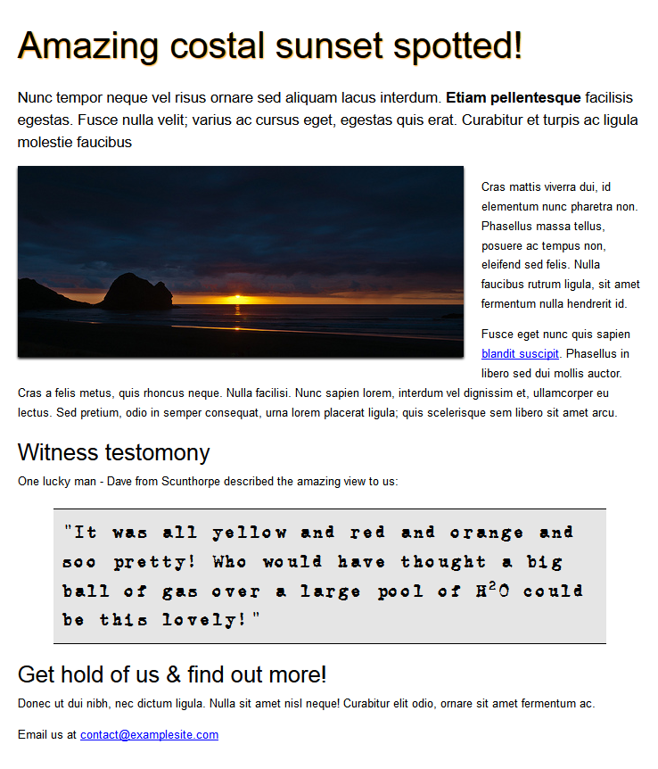

# Reading Room Interface Developer Exercises

The following are a series of exercises to show us your knowledge of HTML, CSS and JavaScript.

## Exercise 1 - Header and Navigation Markup and Styling

### Files reviewed in this exercise

```
exercise01/index.html
exercise01/exercise01.css
```

### Instructions

Using HTML5 and CSS add markup and styling to recreate the following design:



A linked stylesheet ```exercise01/exercise01.css``` has already been created for you. Please add your custom styles to this file. The image logo.png is in the img folder.

Please **do not** use any CSS frameworks such as Bootstrap or Foundation.

We will be paying close attention to the following aspects:

* Valid markup
* Semantic markup
* Class naming conventions
* Accessibility
* Design accuracy

## Exercise 2 - Semantic Markup

### Files reviewed in this exercise

```
exercise02/index.html
```

### Instructions

Using the following design as a reference:



Using your best judgement, add the correct HTML/HTML5 tags for each element. Include the image sunset.jpg in the img folder. You **do not** need to supply any CSS for these elements they should remain unstyled.

We will be paying close attention to the following aspects:

* Valid markup
* Semantic markup
* Accessibility

## Exercise 3 - jQuery / JavaScript

### Files reviewed in this exercise

```
exercise03/index.html
exercise03/exercise03.css
exercise03/exercise03.js
```

### Instructions

Using jQuery or pure JavaScript, modify the current code to allow the panels to show and hide on click.

The following rules should be adhered to:

* When the user clicks anywhere on the header section, the list below should show or hide depending on its current state.
* When the list is visible the header should show a minus (```-```) character.
* When the list is not visible the header should show a plus (```+```) character.
